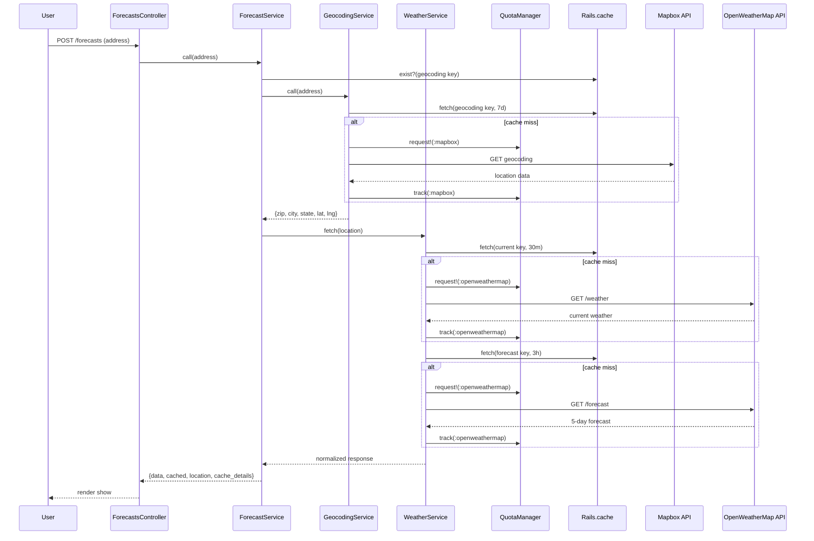

# Weather Forecast

**Demo:** [weather-app.restot.top](https://weather-app.restot.top/)

Rails app that takes a US address, geocodes it, fetches the weather, and caches results by coordinates.

What you get: current temp/conditions, daily high/low, 5-day forecast, and humidity. Current weather is cached for 30 minutes and the extended forecast for 3 hours — a "Cached" badge shows when you're seeing stored data.

## How it works

The controller hands off to `ForecastService`, which geocodes the address via Mapbox and calls `WeatherService` for weather data. `WeatherService` caches current weather (30 min) and the extended forecast (3 hours) by coordinates. Each API provider has rate limiting and quota tracking through `QuotaManager`. All business logic lives in service objects under `app/services/`.



## Tech stack

| What | Choice | Why |
|------|--------|-----|
| Framework | Rails 8.1 / Ruby 3.4 | |
| Geocoding | Mapbox | 100k/mo free |
| Weather | OpenWeatherMap | 1M/mo free |
| CSS | Pico (CDN) | No build step, dark mode |
| HTTP | HTTParty | |
| Tests | RSpec + WebMock | |
| Cache | Memory (dev) / Redis (prod) | |

## Environment variables

| Variable | Required | Description |
|----------|----------|-------------|
| `MAPBOX_API_KEY` | Yes | Mapbox geocoding API key ([get one](https://account.mapbox.com/)) |
| `OPENWEATHERMAP_API_KEY` | Yes | OpenWeatherMap API key ([get one](https://home.openweathermap.org/api_keys)) |
| `SECRET_KEY_BASE` | Prod only | Rails secret (`bin/rails secret`) |
| `REDIS_URL` | Prod only | Redis connection URL (default `redis://redis:6379/0`) |
| `CLOUDFLARE_TUNNEL_TOKEN` | No | Cloudflare Tunnel token for zero-trust access |
| `AXIOM_TOKEN` | No | Axiom API token for log shipping ([get one](https://axiom.co/)) |
| `AXIOM_DATASET` | No | Axiom dataset name to ingest logs into |
| `MAPBOX_QUOTA_OFFSET` | No | Added to tracked Mapbox monthly usage (default `0`) |
| `OPENWEATHERMAP_QUOTA_OFFSET` | No | Added to tracked OpenWeatherMap monthly usage (default `0`) |

## Setup

### Local

```bash
cd weather_forecast
bundle install
cp .env.example .env
# Add your MAPBOX_API_KEY and OPENWEATHERMAP_API_KEY
bin/dev
```

Open http://localhost:3000

### Docker

```bash
cp .env.example .env
# Add API keys, SECRET_KEY_BASE (rails secret), optionally CLOUDFLARE_TUNNEL_TOKEN
docker-compose up -d
```

Starts Rails, Redis, Nginx (port 80), Fluent Bit (log shipping to Axiom), and optionally a Cloudflare tunnel.

## Tests

```bash
bundle exec rspec                    # run full suite
bundle exec rspec --format documentation  # verbose output
bundle exec rspec spec/services/     # run service specs only
bundle exec rspec spec/requests/     # run request specs only
```

Covers services, request cycle, and cache behavior (94 examples). No API keys or network access needed — all HTTP calls are stubbed with WebMock.

## Tradeoffs

| Decision | Trade |
|----------|-------|
| Memory cache in dev | Simple, no persistence — Redis in prod |
| Mapbox over Google | Generous free tier, maybe less accurate |
| No database | Can't store history or favorites |
| Pico CSS via CDN | No build step, less customization |
| Cache by zip | Efficient for nearby addresses, less granular than lat/lng |
| Service objects | More files, but thin controller and isolated tests |
| Debug panel in all environments | This is a portfolio project — the panel shows cache status and quota usage to demonstrate how the internals work |

## What I'd improve with more time

- **Air quality data** — OpenWeatherMap's air pollution endpoint for AQI, PM2.5, O3, and other pollutants alongside the forecast
- **Interactive map** — Mapbox GL JS embed with weather overlay layers (clouds, precipitation, temperature) and bbox-based zoom from geocoder precision
- **Temperature unit toggle** — Fahrenheit/Celsius switch persisted in session
- **Dark/light/auto theme toggle** — Pico CSS supports it natively via `data-theme`; just needs a toggle and session persistence
- **User sessions with favorites and history** — Anonymous cookie-based sessions backed by Redis, with localStorage/fingerprint recovery. Track last 50 searches (24h TTL) and up to 5 saved locations (30-day sliding TTL)
- **Provider abstraction** — Base `GeocodingProvider` and `WeatherProvider` classes with a `ProviderFactory` for ENV-based swapping (e.g., Google Geocoding, WeatherAPI.com)
- **Parallel API requests** — Fetch current weather, forecast, and air quality concurrently with `concurrent-ruby`
- **Request coalescing** — Deduplicate identical in-flight API calls so concurrent users for the same zip don't trigger redundant requests
- **Edge caching** — Cloudflare cache rules with `stale-while-revalidate` and cache tags for targeted purging by zip
- **Health check endpoints** — `/health/live` and `/health/ready` with Redis connectivity and provider configuration checks for container orchestration
- **Horizontal scaling** — Puma cluster mode with `WEB_CONCURRENCY`, Redis connection pooling, nginx least-conn upstream balancing, and Kubernetes cluster readiness
- **Centralized logging** — Request ID correlation and OpenTelemetry tracing (Axiom + Fluent Bit already wired in docker-compose)
- **Error tracking** — Sentry integration for exception monitoring and alerting
- **Weather maps** — OpenWeatherMap tile layers on Mapbox GL JS: precipitation, clouds, pressure, temperature, and wind
- **Historical comparison** — Show today's weather vs. 1, 3, 5, or N years ago using OpenWeatherMap's historical data API
- **CI/CD pipeline** — GitHub Actions for automated tests and deployments on push
- **Push notifications** — Web Push API for weather alerts: temperature drops, severe weather warnings, and custom threshold alerts for saved locations
- **Stripe integration** — Premium tiers for higher alert frequency, additional saved locations, and extended historical data access
- **Feedback form** — Collect user feedback with simple form, stored in database for product insights
- **AI recommendations** — LLM-powered suggestions for trip planning, event scheduling, and activity ideas based on historical weather patterns. Subscribe to AI-monitored alerts that check forecasts every 3h for 5 days ahead and notify on significant changes
## License

[MIT](LICENSE)
